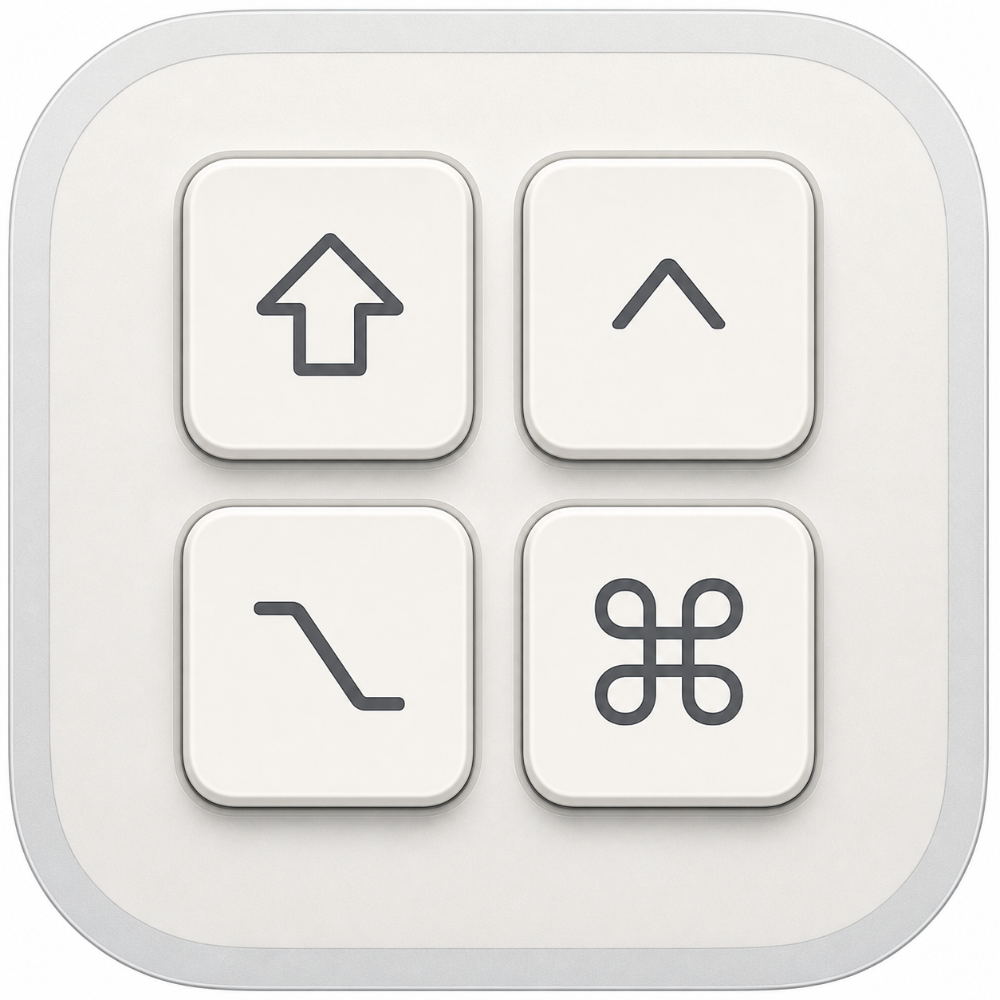
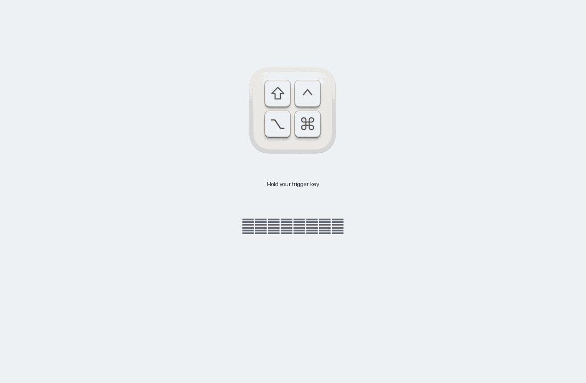
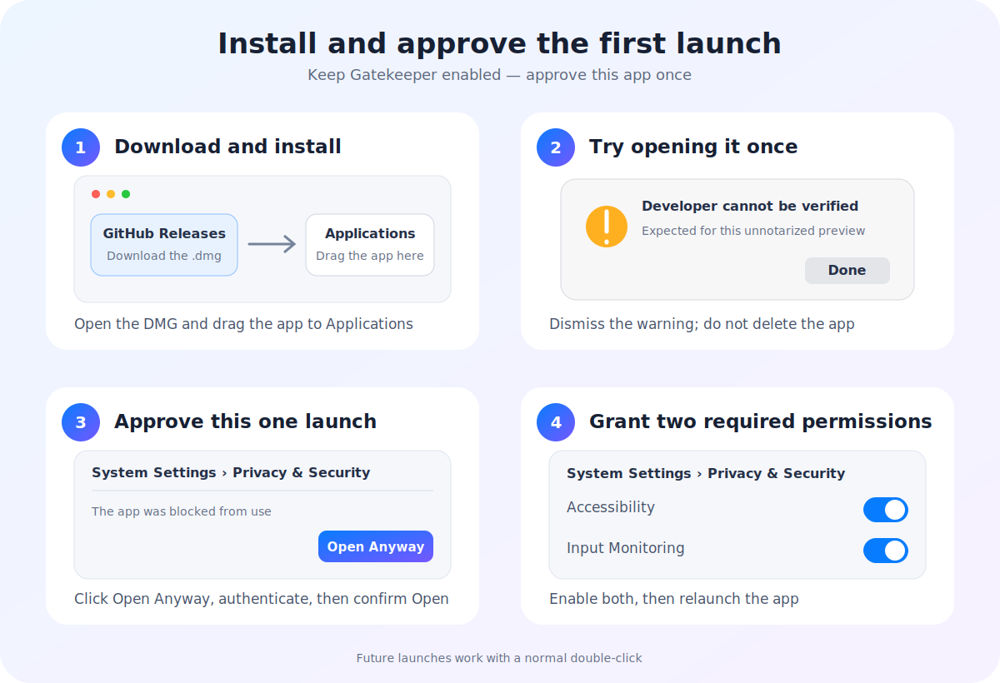
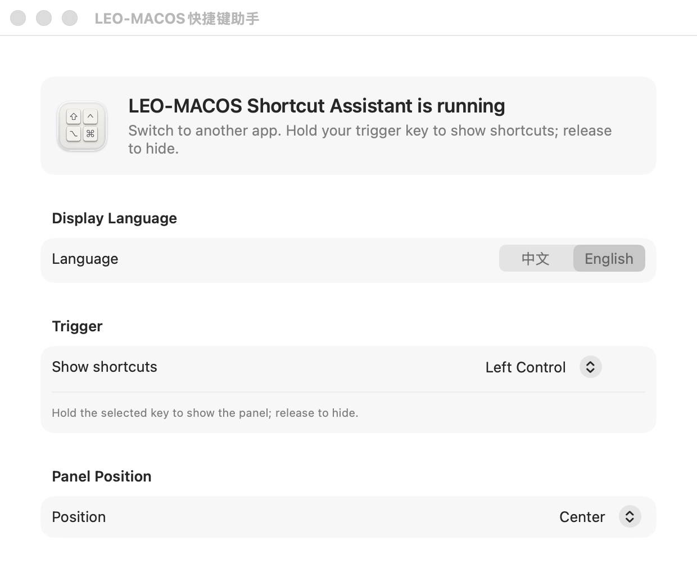
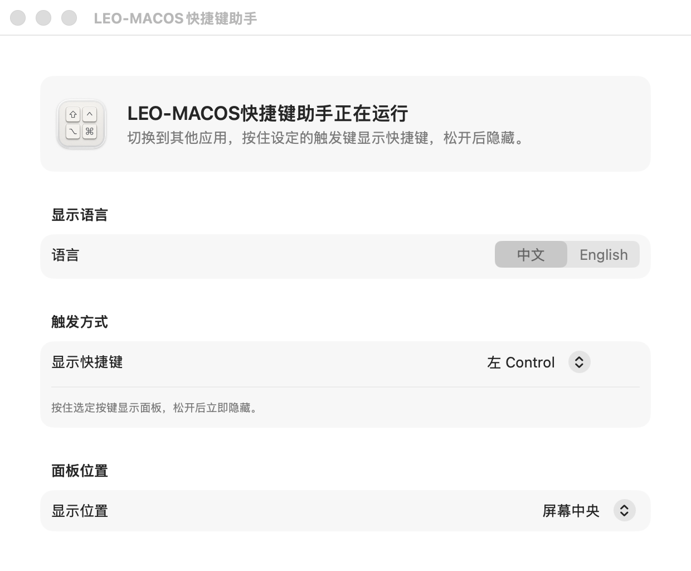
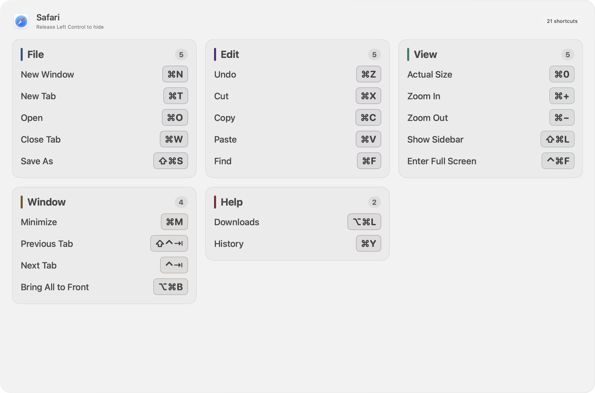

<div align="center">
  
  <h1>LEO-MACOS Shortcut Assistant</h1>
  <p><strong>Hold one key to reveal shortcuts for the app in front. Release to hide.</strong></p>
  <p>
    <a href="README.md">简体中文</a> ·
    <a href="README_EN.md">English</a>
  </p>
  <p>
    <a href="https://github.com/leoyoyofiona/LEO-MACOS-Shortcut-Assistant/releases/latest"></a>
    
    
    <a href="LICENSE"></a>
  </p>
</div>



LEO-MACOS Shortcut Assistant is a native macOS utility that detects the frontmost app and reads shortcuts exposed by its menu. Hold your chosen trigger key to reveal a translucent glass panel; release the key to dismiss it immediately.

## Highlights

- **Follows the frontmost app** — works with Finder, Safari, ChatGPT, productivity apps, and most native macOS software.
- **Hold to show, release to hide** — no persistent overlay and no context switching.
- **Custom trigger key** — choose left/right Control, Option, Command, or Fn.
- **Chinese and English** — the UI and common menu commands switch languages; unknown commands use Apple's on-device translation and a local cache.
- **Adaptive glass panel** — adjusts to appearance, display size, and shortcut density.
- **Scrollable, never truncated** — vertical and horizontal scrolling for large menus.
- **Local-first** — menu data, preferences, and translation cache stay on your Mac. See the [privacy policy](PRIVACY.md).

## Install

### Download a release

1. Open the [latest release](https://github.com/leoyoyofiona/LEO-MACOS-Shortcut-Assistant/releases/latest).
2. Download the `.dmg` (recommended) or `.zip`.
3. Drag `LEO-MACOS快捷键助手.app` into Applications.
4. If macOS blocks the first launch, open System Settings → Privacy & Security and click **Open Anyway**.
5. Grant Accessibility and Input Monitoring access, then relaunch the app.



**First time installing? Read the [complete illustrated installation guide](docs/INSTALL_EN.md).**

> [!IMPORTANT]
> This community preview is not notarized with Apple Developer ID yet. First launch requires a one-time manual approval; future launches work with a normal double-click. Do not disable Gatekeeper.

### Build from source

Requires macOS 15+ and Swift 6:

```zsh
git clone https://github.com/leoyoyofiona/LEO-MACOS-Shortcut-Assistant.git
cd LEO-MACOS-Shortcut-Assistant
chmod +x build-app.sh
./build-app.sh
open "dist/LEO-MACOS快捷键助手.app"
```

## Usage

1. Launch the app and choose a language, trigger key, and panel position.
2. Switch to the app whose shortcuts you want to inspect.
3. Hold the trigger key.
4. Scroll with a mouse wheel or trackpad when the menu is long.
5. Release the trigger key to hide the panel.

## Gallery

### English settings



### Chinese settings



### Shortcut glass panel



## Why permissions are needed

| Permission | Purpose |
| --- | --- |
| Accessibility | Detect the frontmost app and read shortcuts exposed by its menus |
| Input Monitoring | Detect presses and releases of the selected trigger key |

The app does not record normal typing and does not intercept or modify key events. Some cross-platform apps expose only part of their command set through the macOS Accessibility API.

## Roadmap

- [ ] Developer ID signing and Apple notarization
- [ ] Launch at login
- [ ] App-specific shortcut sources from official documentation
- [ ] User-defined shortcuts and favorites
- [ ] Homebrew Cask
- [ ] More languages

## Contributing

Issues, feature ideas, and pull requests are welcome. Read [CONTRIBUTING.md](CONTRIBUTING.md) before starting. Please report security concerns privately as described in [SECURITY.md](SECURITY.md).

## Acknowledgements

The project presentation was informed by excellent open-source macOS utilities including [Ice](https://github.com/jordanbaird/Ice), [Rectangle](https://github.com/rxhanson/Rectangle), [AltTab](https://github.com/lwouis/alt-tab-macos), and [Loop](https://github.com/MrKai77/Loop). No code or visual assets were copied from these projects.

## License

[MIT License](LICENSE)
