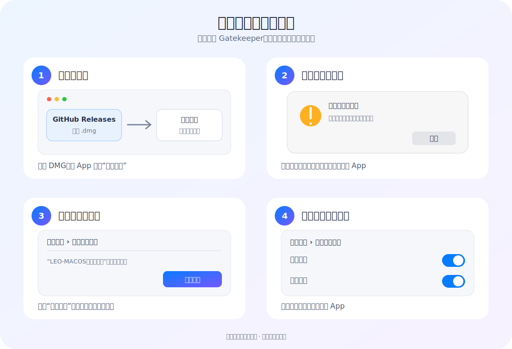

# 安装与首次打开

[返回项目首页](../README.md) · [English](INSTALL_EN.md)

当前社区预览版尚未使用 Apple Developer ID 公证。它可以正常使用，但首次打开时需要在 macOS 中手动确认一次。**不需要，也不建议关闭 Gatekeeper。**

## 第一步：下载并安装

1. 打开 [最新版本下载页](https://github.com/leoyoyofiona/LEO-MACOS-Shortcut-Assistant/releases/latest)。
2. 下载文件名以 `.dmg` 结尾的安装包。
3. 双击打开 DMG。
4. 将 `LEO-MACOS快捷键助手.app` 拖入“应用程序”文件夹。

## 第二步：尝试打开一次

1. 在 Finder 中进入“应用程序”。
2. 双击 `LEO-MACOS快捷键助手`。
3. 如果 macOS 提示无法验证开发者或无法检查是否包含恶意软件，关闭这条提示。
4. 不要删除 App，继续下一步。

## 第三步：点击“仍要打开”

1. 打开 **系统设置 → 隐私与安全性**。
2. 向下滚动到“安全性”区域。
3. 找到关于 `LEO-MACOS快捷键助手` 被阻止的提示。
4. 点击 **仍要打开**，输入 Mac 登录密码或使用 Touch ID。
5. 在随后出现的确认框中再次点击 **打开**。

“仍要打开”按钮通常只会在尝试启动 App 后出现，并会保留约一小时。完成一次确认后，macOS 会记住这项选择，以后可以正常双击打开。参见 [Apple 官方说明](https://support.apple.com/zh-cn/guide/mac-help/mh40616/mac)。

## 第四步：开启必要权限

快捷助手需要两项 macOS 权限：

1. 在 **系统设置 → 隐私与安全性 → 辅助功能** 中开启 `LEO-MACOS快捷键助手`。
2. 在 **系统设置 → 隐私与安全性 → 输入监控** 中开启 `LEO-MACOS快捷键助手`。
3. 完全退出并重新打开快捷助手。

| 权限 | 用途 |
| --- | --- |
| 辅助功能 | 识别当前应用并读取它向 macOS 公开的菜单快捷键 |
| 输入监控 | 只识别所选触发键的按下与松开 |

应用不会记录普通键盘输入，也不会拦截或修改按键事件。

## 验证是否安装成功

1. 打开快捷助手，在设置中选择触发键。
2. 切换到 Finder、Safari 或其他应用。
3. 按住触发键，快捷键面板应立即出现。
4. 松开触发键，面板应立即隐藏。

## 常见问题

### 找不到“仍要打开”按钮

先回到“应用程序”双击一次快捷助手，再立即打开“系统设置 → 隐私与安全性”并向下滚动。“仍要打开”只在系统拦截过启动后显示。

### 权限开关已经打开，但触发键没有反应

分别关闭再重新开启“辅助功能”和“输入监控”中的快捷助手，然后完全退出并重新打开 App。如果列表中有旧版本条目，请先删除旧条目，再添加“应用程序”中的当前版本。

### 公司或学校的 Mac 无法放行

受组织管理的 Mac 可能禁止用户手动打开未公证应用，需要联系设备管理员。不要尝试关闭系统安全功能。
